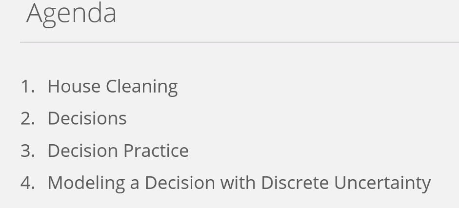
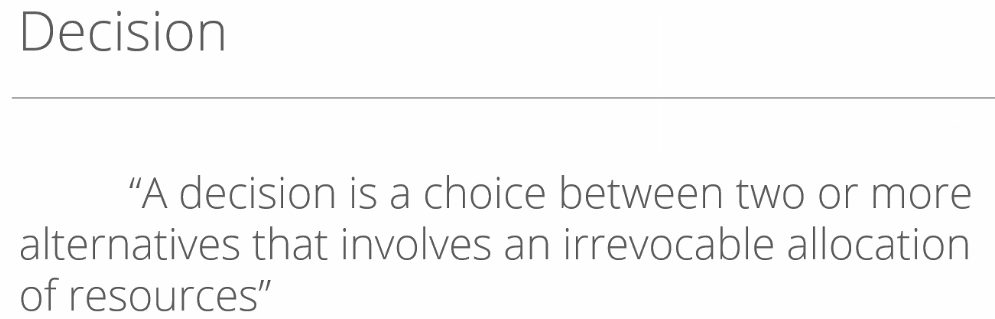
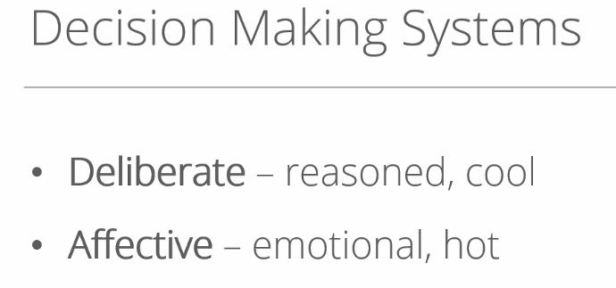
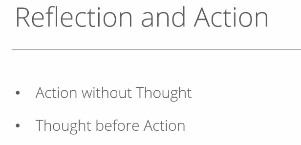
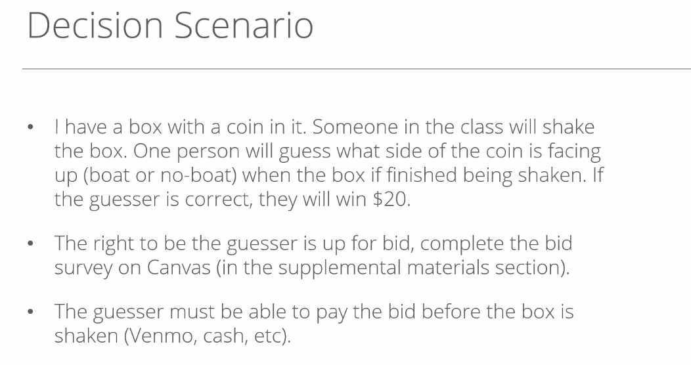
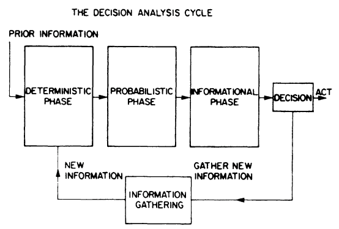

# Class notes

What makes decision making hard is the uncertainty and stochasticity. If you’re calculating the value of something you need to be able to understand how uncertainty and reducing uncertainty around that decision in a computational way can allow you to make a clear determination on how much value you’re providing by reducing that uncertainty. You need to have basic modeling tools to build those models.

Once you make a decision you can’t take it back. If you are not putting something of value on the line, you did not make a decision. Decision requires commitment of resources which you cannot take back. 

Once you make a decision you can’t take it back. If you are not putting something of value on the line, you did not make a decision. Decision requires commitment of resources which you cannot take back. 

The more analysis that you do, the lesser decisions you need to take.

You cannot take action without thought. You should put thought before action to have the maximum the value that you get from a given opportunity. 
Decisions are hard because of uncertainty. If you knew the constraints of a problem and you knew that were true, it would just be an optimization problem. In the real world you do not know the outcome of the problem. We use machine learning to reduce uncertainty in our decision outcomes.

People are judged on their outcomes and not necessarily on their well-thought-out decisions. Sometimes, we can’t control the outcome. Goal of reducing uncertainty is important to help manage the outcomes that we can influence on average.

We’ll look at some tools that will help us work with clarity (not certainty), but clarity.

People guessing <20 - Risk averts.

Decision nodes has branches, and the possibilities of the uncertainty nodes are called prospects. Prospects have a terminal value associated with them.
Probability is basically a belief. Different people can have different probability for the same event depending on the prior information.

Foundations of Decision Analysis by Ron Howard et. al.

The problem of the decision maker is to select a course of action in a world that is perceived as uncertain, complex, and dynamic. Decision requires a course of action is to make a commitment of resources which you cannot take back. 

Decision nodes has branches, and the possibilities of the uncertainty nodes are called prospects. Prospects have a terminal value associated with them.
Probability is basically a belief. Different people can have different probability for the same event depending on the prior information.

Foundations of Decision Analysis by Ron Howard et. al.

The problem of the decision maker is to select a course of action in a world that is perceived as uncertain, complex, and dynamic. Decision requires a course of action is to make a commitment of resources which you cannot take back. 
